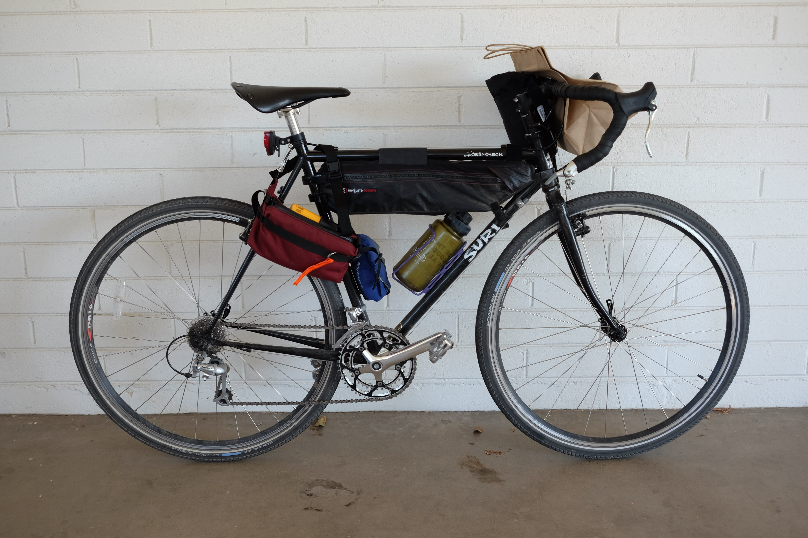
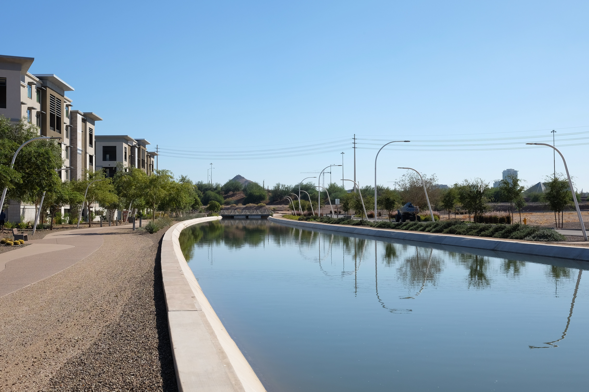
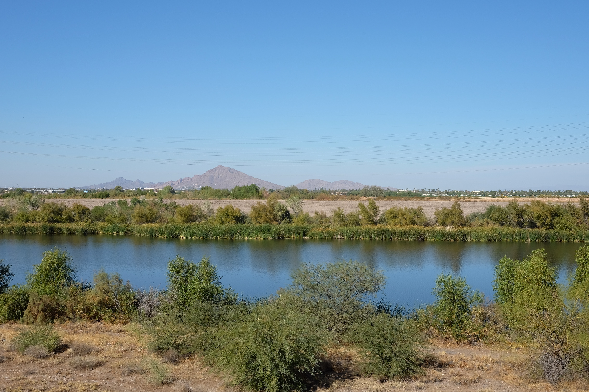
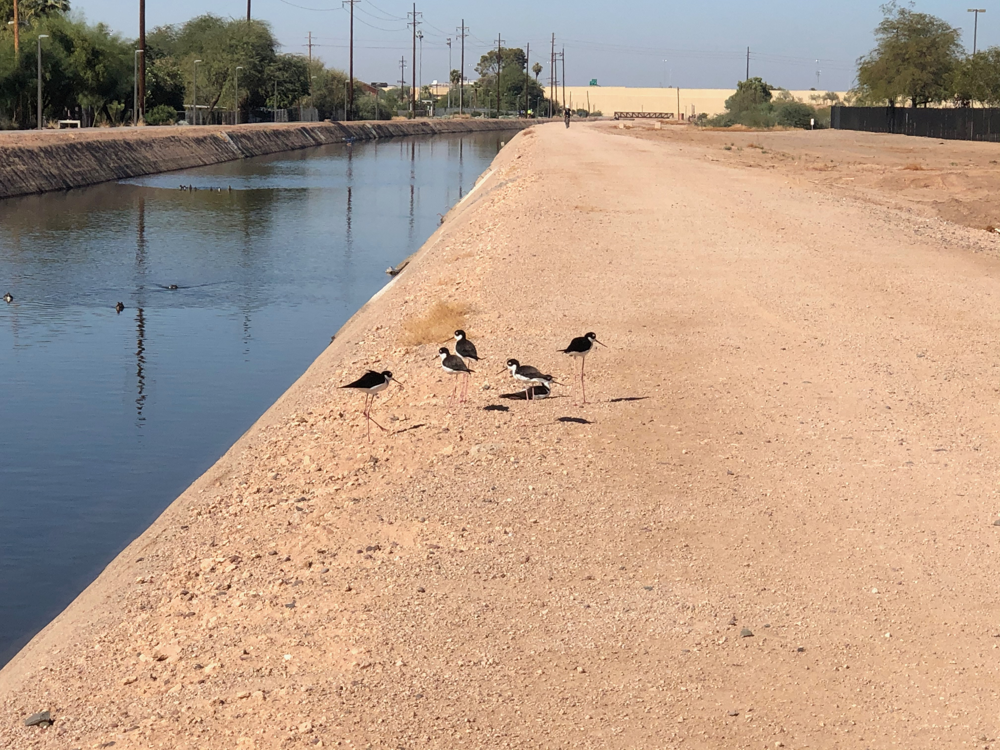
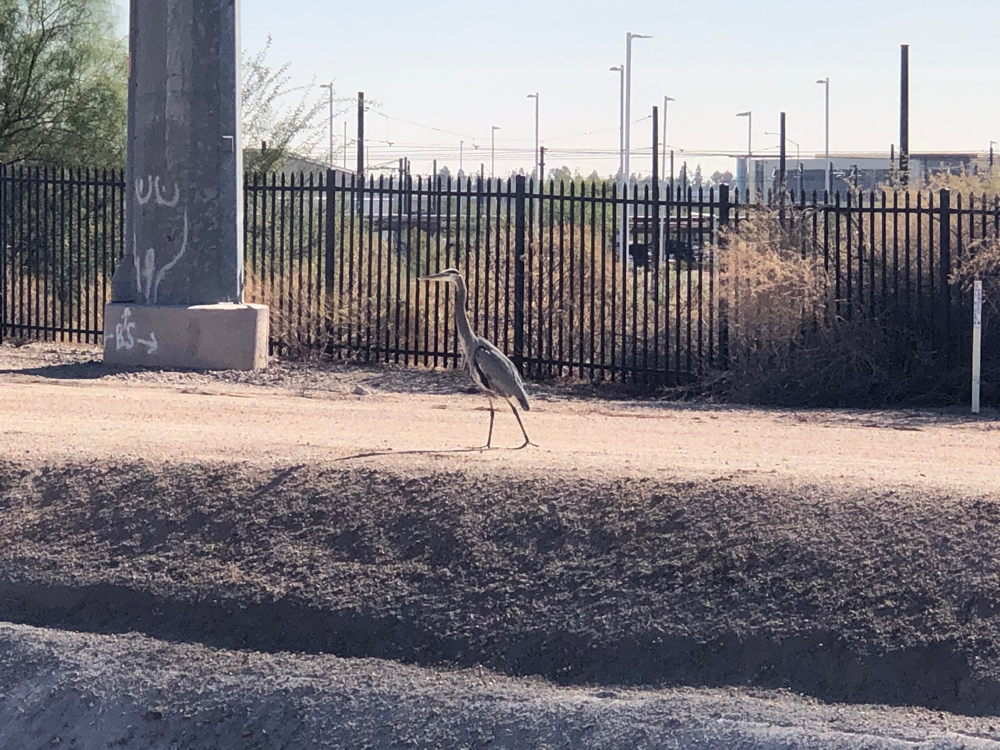
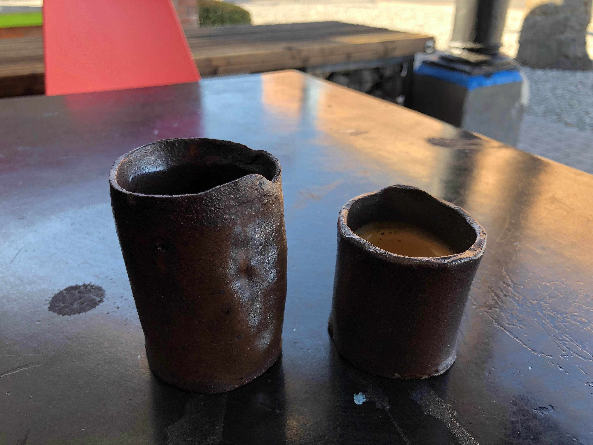
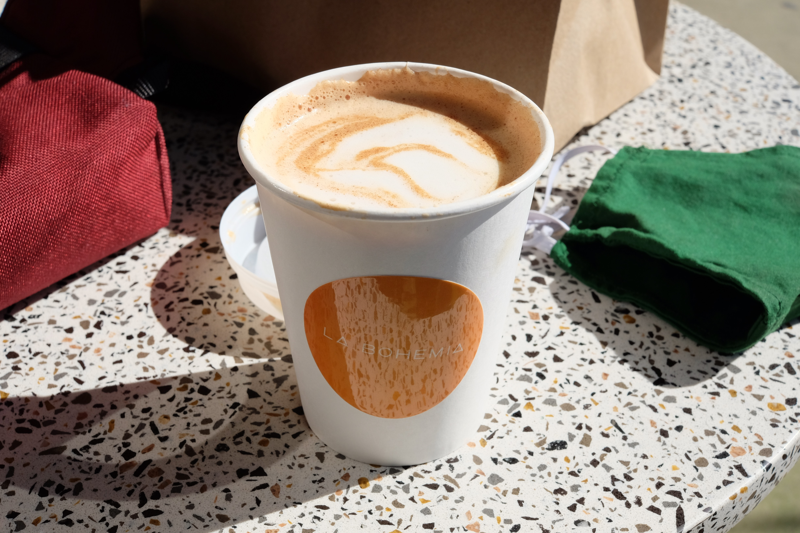
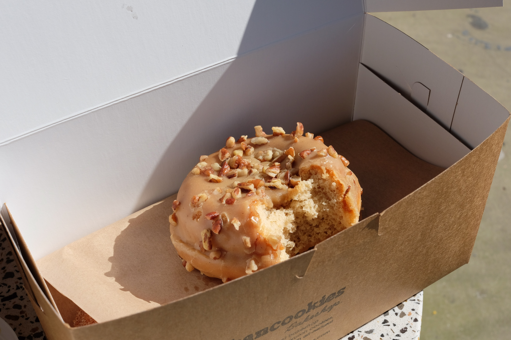

- Ride #4
- Date: 2020-11-14
- [Instagram](https://www.instagram.com/p/CHmEs88poAl/)
- Distance: 41.23 miles – [Strava](https://www.strava.com/activities/4338377664)
- Drink: Espresso, Mocha, Donuts
- Location: [Xanadu Coffee](https://www.instagram.com/xanadu.coffee/), [La Bohemia](https://www.instagram.com/labohemiaphx/), [Urban Cookies](https://www.instagram.com/urban_cookies/)

There's so much good coffee and food that I never get to in downtown Phoenix. There's even a nice 20 mile route through a pretty easy series of bike routes and canals to get there. So coffeeneuring was a great excuse to get out and try some new places. I figured I would probably only get downtown once so I wanted to hit a few places even though it would only count towards one coffeeneuring challenge trip.

## The Ride

The Grand Canal connects my normal route from Mesa to Tempe with

My kids love animals, so when I saw some interesting looking birds I thought it would be fun to take pictures and try to identify them when I got home. We looked them up and [a super cool](http://www.birderfrommaricopa.com) website about birds in Maricopa County.

## The Drink(s)

I stopped at Xanadu Coffee first and I heard they make good espresso, so I kept it simple with a plain espresso.

## One Good Thing
