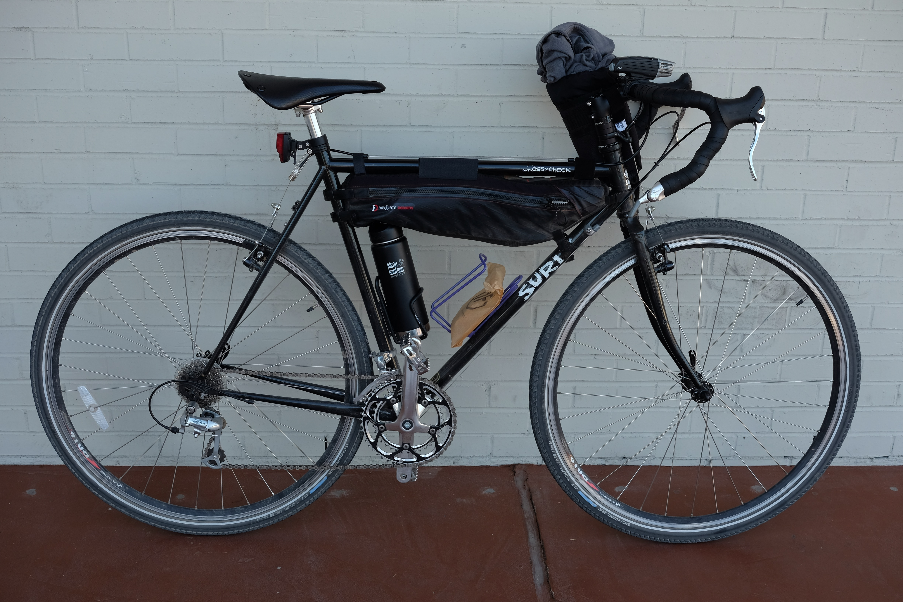
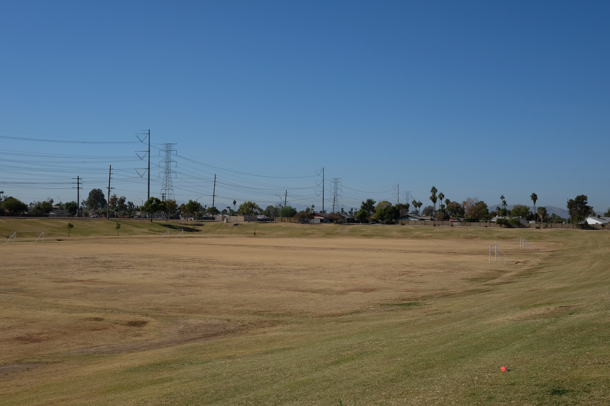
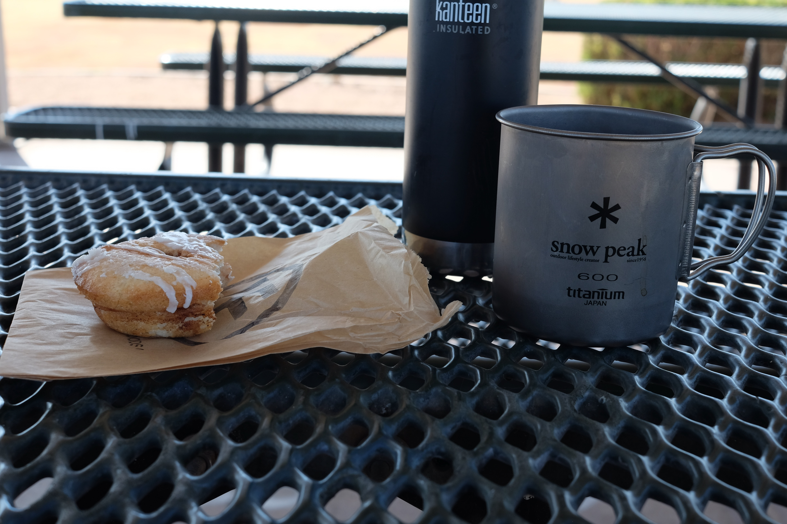

- Ride #5
- Date: 2020-11-19
- Distance: 19.28 miles – [Strava](https://www.strava.com/activities/4362791578)
- Drink: Peixoto Drip Coffee
- Location: [Intentional Foods](https://www.instagram.com/intentionalfoods/), [Peixoto](https://www.instagram.com/peixotocoffee/)

I had a different coffee shop planned for this that I wanted to ride to after an appointment. But I didn't have the energy after my appointment but luckily for me there was a restaurant serving coffee and donuts next door. I still got to enjoy a pretty good coffee and a great donut.

<figure>
  
  <figcaption>
    This time I did NOT attempt to ride with an unattached donut bag on my bike
  </figcaption>
</figure>

## The Ride

A very basic ride. I don't think I even technically left Mesa. I stayed on Extension (Mesa Bike Route #3) for the North/South bits of the ride. I took the most direct route on the way there since I was running late for my appointment.

On the way back I swung by a nice big basin park to drink my coffee and enjoy my donut.

<figure>
  
  <figcaption>I love a good basin in a park</figcaption>
</figure>

The park was along the Western Canal which I hopped on for a short bit on the way home before hooking back up with Extension.

## The Drink(s)

I brought my insulated Kleen Kanteen and camp mug and it turned out to be a great idea. I went to Intentional Foods which is a dedicated gluten-free (and other food allergy) restaurant. They were serving drip Peixoto coffee, which is a coffee shop in Chandler that I really like. The owner was kind enough to bring out the whole big coffee pump thing and let me fill up my bottle as much as I wanted!

The donut was a baked cinammon roll donut. It was cut in half and spread with cinammon glaze and topped with icing. And as you might've guessed, it tasted delicious when dipped in coffee.

<figure>
  
  <figcaption>
    It is never a mistake to bring a Kleen Kanteen. It provides the ability to
    make to-go coffee really to-go on a bike.
  </figcaption>
</figure>

## One Good Thing

This "One Good Thing" requirement I gave myself started out as something I was hoping to plan into each ride. But instead it became more of a "Look Back on the Ride for Something I'm Grateful For", which is still fits spirit of the theme for me.

So in this case, I'm grateful that I found a way to make a doctor's appointment into something fun with a park coffee/donut reward.
