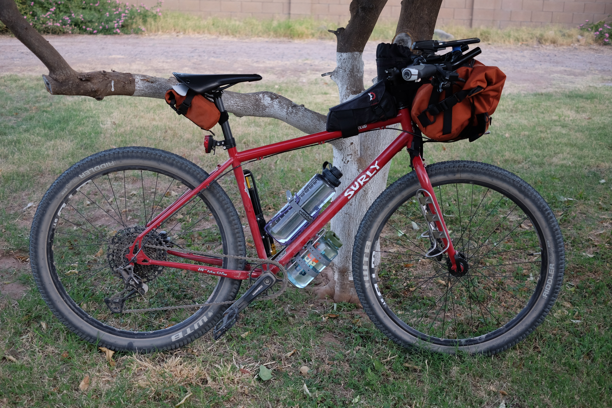
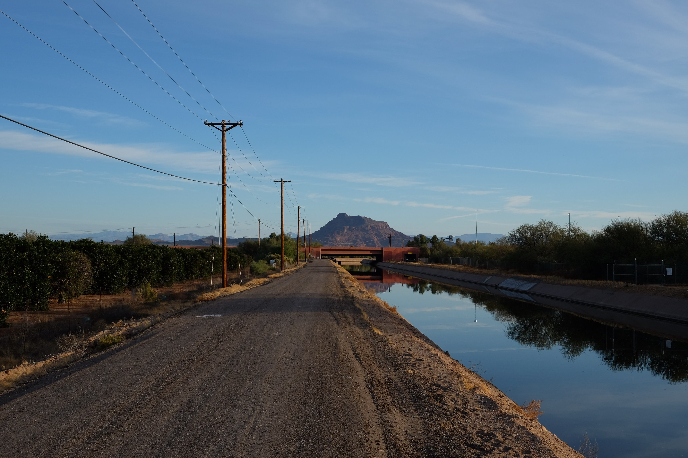
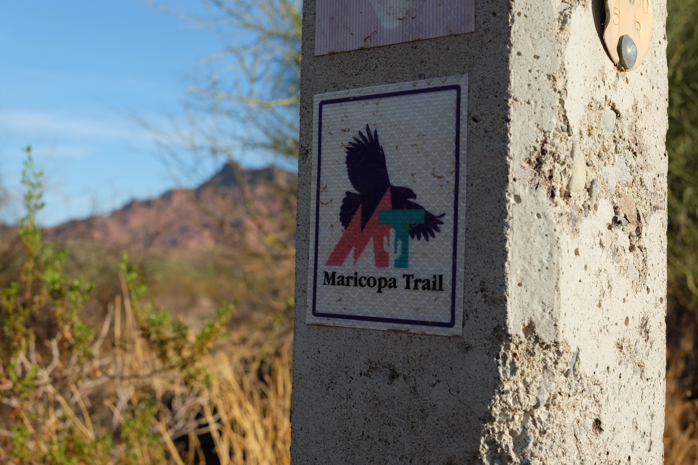
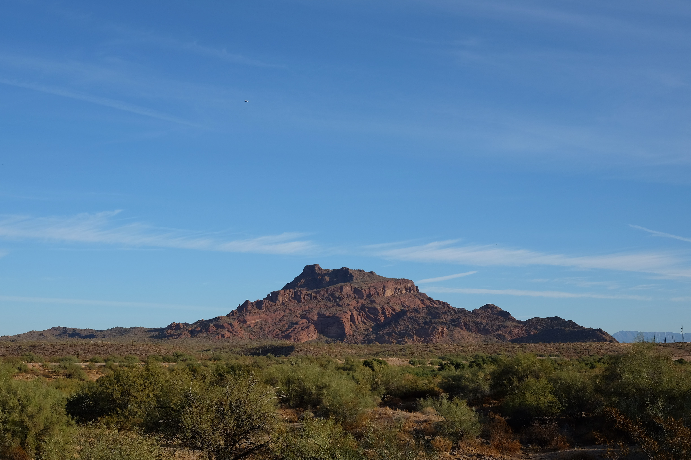
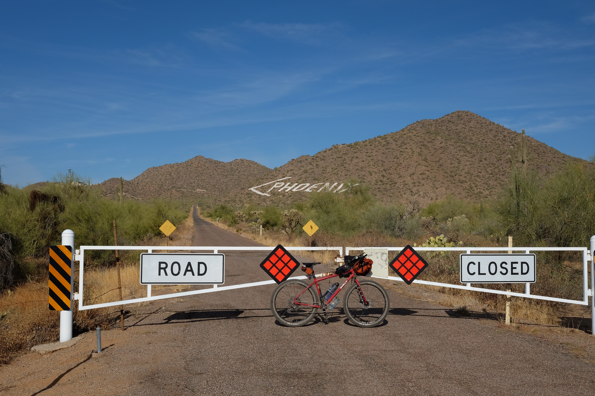
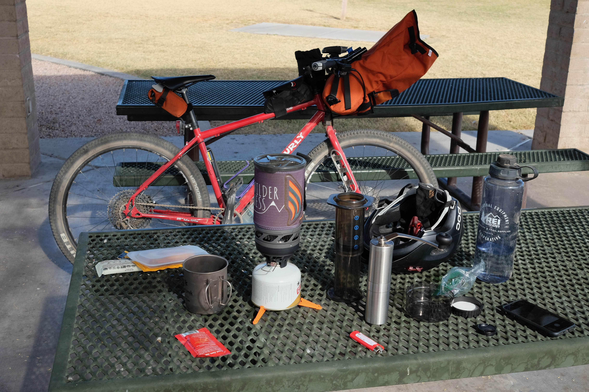

- Ride #6
- Date: 2020-11-21
- Distance: 35.8 miles – [Strava 1](https://www.strava.com/activities/4371313165) [Strava 2](https://www.strava.com/activities/4371314793)
- Drink: JetBoil Aeropress
- Location: [Hawes Trail System](https://hawestrailalliance.com), [Red Mountain Park](https://www.mesaparks.com/parks-facilities/parks/red-mountain-park)

I wanted to get one "Cofeeshop Without Walls" badge for this year's challenge. I planned out this route pretty well, including a canal that I was pretty familiar with and connecting that with some singletrack that I've run but never biked before. I left it up to how I felt at the time to decide where to make the coffee and whether to do an out-n-back or make a loop and return home via roads.

## The Ride

## The Drink

## One Good Thing

Singletrack!
