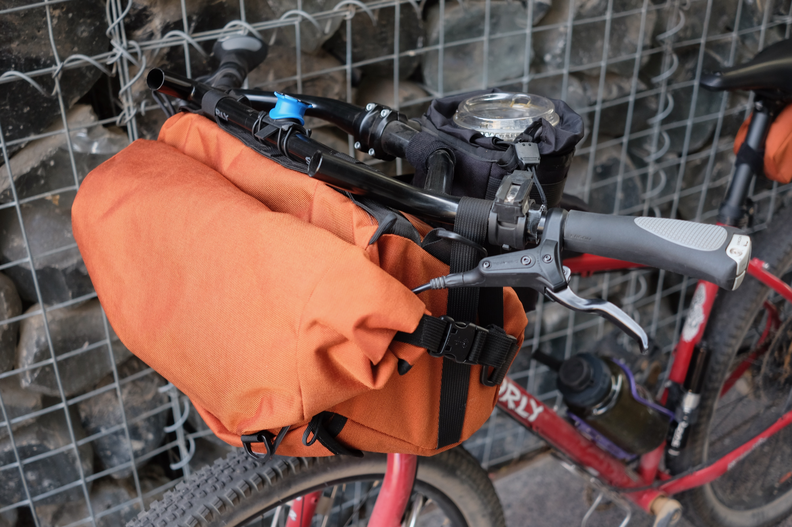
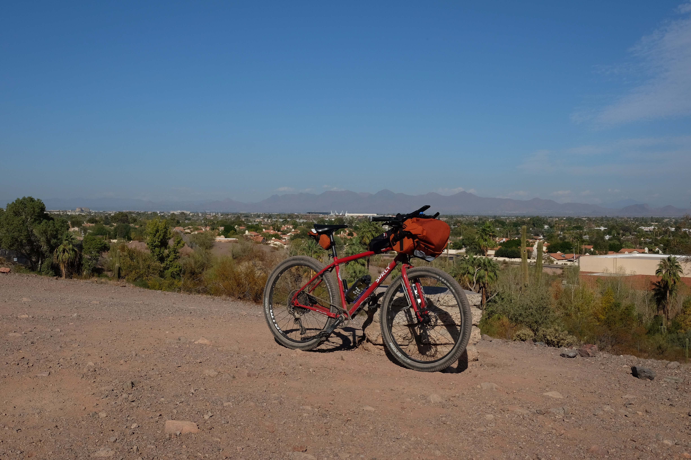
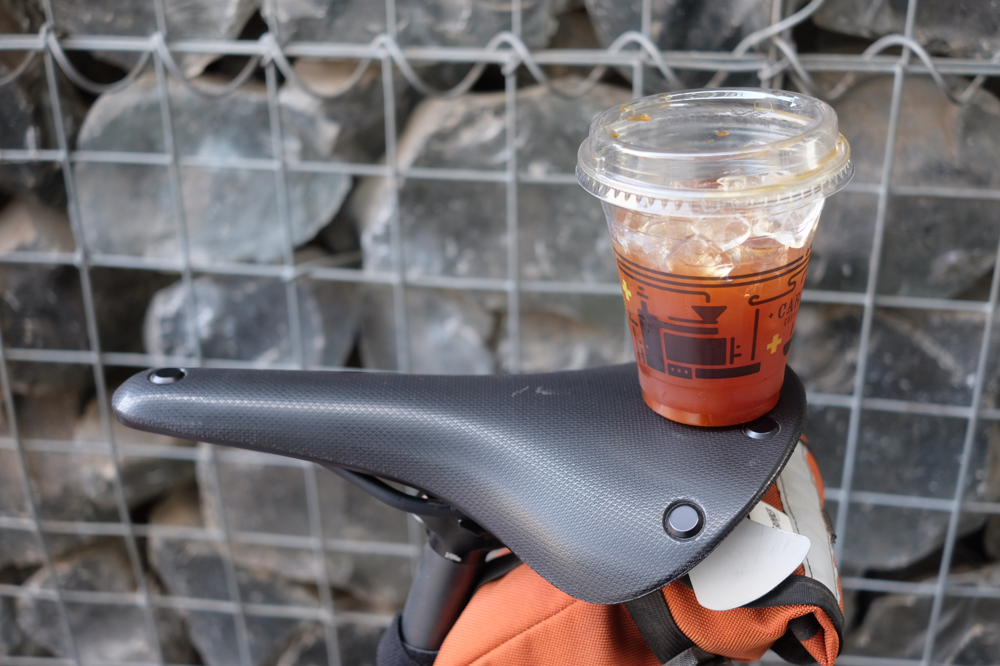

- Ride #7
- Date: 2020-11-23
- Distance: 23.57 miles – [Strava](https://www.strava.com/activities/4381865429)
- Drink: Iced Americano
- Location: [Cartel Coffee Lab](https://www.instagram.com/cartelcoffeelab), [Papago Park](https://www.tempe.gov/Home/Components/FacilityDirectory/FacilityDirectory/146/2423?npage=4), [Bicycle Cellar](https://www.instagram.com/bicyclecellar/)

Down to the last day of the challenge, I just needed to ride my bike somewhere to get coffee that I hadn't already been to. I also needed a new stem for my bike. Good thing Cartel Coffee is right by my favorite bike shop The Bicycle Cellar in Tempe!

## The Ride

I took University all the way down to grab coffee and make my Bicycle Cellar appointment on time. On the way bike I went through Papago and hit some climbs that I had to push up! I also came across a part of Papago I didn't know existed which some small dirt jumps. There's no way I was touching any of those so I slowly walked my bike down and rode over to the nice flat canal.

## The Drink

An 80 degree day in November meant it was still iced coffee weather. I went with a small Iced Americano (since it was already the afternoon) and chugged it. It was just too good to savor it.

## One Good Thing

New bike stem!
