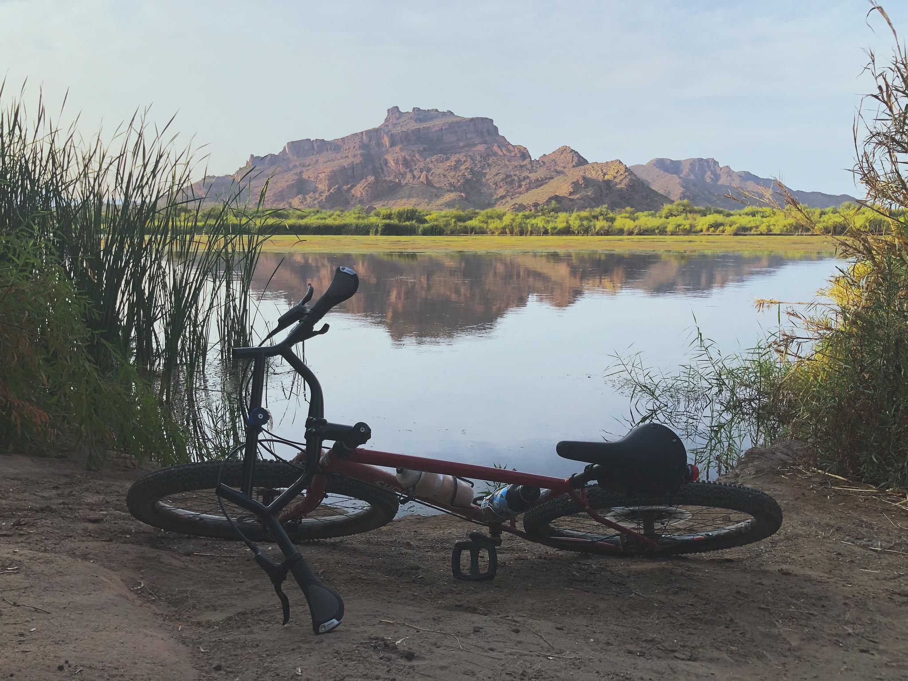

With the dream of bikepacking and having more fun on non-paved surfaces, I was looking for a new bike. Actually, I'm always looking for new bikes and the top result in my Craigslists search history is always "Surly". I read a bunch of forum posts, watched videos, and posted a question to the Internet to see if the Surly Bridge Club was the right bike for me after [falling in love with it while reading this post](https://surlybikes.com/blog/make_it_your_own_pack_it_in_pack_it_out_with_the_surly_bridge_club).

Turns out it is an awesome bike and I love it. So far I've made the following changes from the stock 2020 27.5 Medium Bridge Club:

- Surly Moloko bars
- Ergon GC1 grips
- Brooks C17 Cambium saddle
- A few random bottle cages I stole from my other bikes
- An old saddle bag
- King Cage ManyThing cages. I have no idea what to use these for yet but I bought them on a whim 🤷‍♂️

Some plans I have for it:

- Widefoot liter cages since it is darn hot here in the desert. I don't mind the heat and would like the ability to bikepack through 90-100 degree days so I think I'll need multiple 48oz bottles and a bladder.
- The frame, handlebar, and seat bag bikepacking trifecta. So many cool bag makers and everything is backordered it seems so I've had endless time to look. But I have no idea on sizes. I want to keep my ability to overpack to a minimum while still having enough room to grow into week-ish long trips. I have my eye on Rogue Panda and Road Runner bags.
- Tubeless tires. So far I'm averaging 1 flat/week with thorns in the desert so I love the idea of less tire maintenance.
- Put some supple bar tap on the front holds of the Moloko bars
