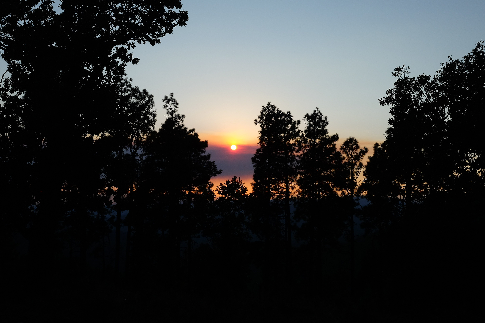
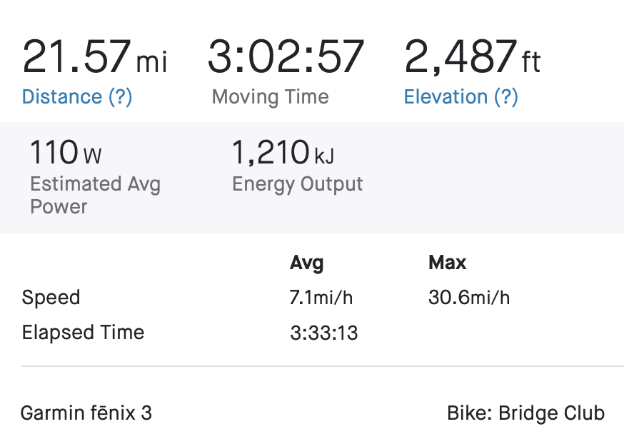

If you know me, then you know I love taking any plans I have and figuring out how to add a physically or logistically difficult endeavor on top of that.

So since we had a family camping trip planned for somehwere up on top of the Mogollon Rim I was thinking, "How could I ride my bike there?" My first idea was to get a super early start on the day and ride [all the way from Payson (including pushing my bike up the Rim from Washington Park)](https://www.gaiagps.com/map/?loc=11.7/-110.9728/34.3596&popupLoc=-110.97282/34.35957&pubLink=66vrMyL3dlmQ7MRQH2T4UEs6&trackId=8b5a7f0ef81bb1939db83cc471700aa3), but timing forced me to scrap that. I settled on [this route starting at Colcord Road](https://www.gaiagps.com/map/?loc=10.5/-110.9864/34.3793&popupLoc=-110.95117/34.28793&pubLink=W8FJ3Ikew6aw3fzeryuKoPhF&trackId=630da2c2-10c6-4e80-9e18-e4f955b29888) which meanders over to Young-Heber road before taking Rim Road over to the camping spot.

## The Stuff

Even though I was going to have access to a car for my stuff, my goal was to pack everything I would need for the weekend on my bike. A quick list off that I'm not doing to double-check to confirm:

- Bedrock Coconino seat bag
- Revelate Harness + 20L Sea to Summit dry bag
- Revelate Tangle frame bag
- Revelate Mountain feed bag
- Revelate MagTank
- RoadRunner Auto-Pilot stem bag
- Kelty Cosmic 20deg sleeping bag
- Nemo Hornet 2p tent
- Therm-a-Rest NeoAir
- Misc bike tools + pump
- Clothes!
- Food! (I think I brought enough for 2.5 days but I cheated and ate a bunch from the misc coolers and drank some ice cold Topo Chicos)
- Stove + gas + titanium pot + mug
- Water filtration + bladder (went unused since we brought two 7 gallon refills in the car)
- King Cage ManyThing Cages for tent/food/water
- Widefoot Liter cage
- Ultralight dry bag with food that I wore a bunch of holes in by strapping it to a metal cage

## The Ride

We ran a little bit late getting out of the valley because that happens every single time. I was thinking the ride would take me about 3h30m and I got on the road at about 3:15pm and civil twilight ended at 6:41pm so I knew I was going to be racing daylight no matter what.

The crux of the climbing comes in a [4.3mi / 1239ft climb](https://www.strava.com/segments/11726870) and I was not ready for that on a loaded bike. I walked my bike on many of the steeper sections or when my legs couldn't take it anymore. I ended up averaging 3.5mph.

After the climb I hit the paved section of the highway and it was clear that this wasn't going to help me make up anytime. The sun was setting.

I didn't have great service but I texted my wife something like this not knowing if she was going to get it or not:

> Hey, don't worry I brought lights but if you do want to drive the 7 miles along Rim Road to come get me I wouldn't be opposed

But I kept trudging along until I got to Rim Road and decided to stay on the paved portion as long as I could instead of going on Old Rim Road.

I made it to where the road transitions to dirt but sections of it are basically sand. Another thing I underestimated was how much traffic there would be on the road on Friday night. Cars and trucks with trailers were zipping by kicking up a lot of dust and forcing me over to the side where the dirt/sand was making me go even slower.

And then in a stroke of luck, I hit a really bad section of dirt sand and had to walk for second just as a friend who was camping with us drove by in his truck. He turned around asked if I was still having fun, to which I responded with "Please help me put my bike in your truck"

## The Stats

Here's a map of my final route (see if you can spot the two wrong turns) with a big X of where I should've ended up.

I can't imagine how I would've felt or how long it would've taken me to get there in the dark, with all those cars, and the road conditions being so much harder to ride than I expected.

And I didn't even realize until after the ride, but I nailed my timing prediction within a few minutes (just ended up 6.5 miles short 😂).

## The Lessons

- It's going to take a lot longer to get miles on a loaded bike until I get some more fitness
- Road conditions matter a lot even when it's flat
- Really glad I didn't push my bike up Washington Park

## Up Next

I'm planing a real-life weekend bikepacking trip and hoping to apply the lessons I learned here by limiting daily mileage based on elevation gain and road conditions. Not sure exactly when or where yet but I'm excited. 🎉
